# Ayu-Trial Fabric (SIH Problem Statement ID 26046)
### Cryptographic Clinical Governance Compiler & Protocol Amendment Fabric for Ayurveda Trials
**Ministry of Ayush / All India Institute of Ayurveda (AIIA)**

---

## 1. Executive Summary

Clinical trial protocol amendments in India are notoriously slow, error-prone, and vulnerable to regulatory deviations. Under the **New Drugs and Clinical Trials (NDCT) Rules 2019** and the **ICMR 2017 National Ethical Guidelines for Biomedical and Health Research**, changing a clinical trial parameter (such as a visit assessment window) ripples across multiple investigational centers, participant cohorts, case report forms (CRFs), electronic data capture (EDC) systems, and ethics clearances.

**Ayu-Trial Fabric** is an enterprise-grade Clinical Governance Compiler and Provenance Engine. It treats clinical trial protocols like executable software:
- Protocol changes are drafted as atomic, versioned **ChangeSets**.
- A deterministic **Dependency Resolver** calculates the blast radius across sites, visits, participants, and data systems.
- A clinical rule engine evaluates Indian statutory rules (ICMR, NDCT, Ayush GCP, Drugs & Cosmetics Act).
- A **Readiness Gate** enforces `BUILD FAILED` until all blocking findings receive verifiable evidence.
- Once evidence is verified by designated governance roles (Ethics Reviewer, Monitor), recompilation yields `BUILD PASSED` with complete snapshot immutability.
- Every state mutation is cryptographically anchored into an append-only **SHA-256 Merkle Audit Chain** with instant tamper detection.
- A safe **Advisory AI layer** assists clinical investigators with plain-English regulatory citations while being physically prevented from mutating trial state by database-level default-deny guards.

---

## 2. System Architecture

```mermaid
flowchart TD
    subgraph ClientLayer["Part A: Judge-Facing Frontend (React + Vite + Tailwind)"]
        UI_Dash["Clinical Dashboard"]
        UI_CS["ChangeSets & Impact Graph"]
        UI_Compiler["Compiler Pipeline View"]
        UI_AdvModal["Advisory AI Consultation Modal"]
        UI_AuditModal["Merkle Audit Trail & Tamper Verifier"]
    end

    subgraph APILayer["FastAPI Gateway (Port 8000)"]
        API_Auth["/api/v1/auth (JWT & RBAC)"]
        API_Trials["/api/v1/trials & /sites & /participants"]
        API_CS["/api/v1/changesets (CRUD & Impact Graph)"]
        API_Compiler["/api/v1/compiler (/evaluate, /run, /evidence)"]
        API_Audit["/api/v1/audit (/trail, /verify)"]
        API_Adv["/api/v1/advisory (/summarize, /explain, /mappings)"]
    end

    subgraph CoreEngine["Part B: Compiler & Provenance Core"]
        Resolver["Dependency & Blast Radius Resolver"]
        RuleEngine["Statutory Rule Engine (10 Rules / 6 Domains)"]
        OblGen["Obligation & Evidence Generator"]
        Readiness["Readiness Calculator (DB-Computed Gate)"]
        AuditService["SHA-256 Merkle Chain & Tamper Engine"]
        AdvService["Advisory AI Engine (Statutory Grounding)"]
        Guardrails["3-Layer AI Default-Deny Interceptor"]
    end

    subgraph DataLayer["Dual-Dialect Storage Layer"]
        Postgres["Primary: PostgreSQL (Production)"]
        SQLite["Hermetic Fallback: SQLite (Local/Offline Demo)"]
    end

    ClientLayer --> APILayer
    APILayer --> CoreEngine
    CoreEngine --> DataLayer
```



### Architectural Highlights
1. **Deterministic 7-Step Compiler Pipeline**:
   `ChangeSet` $\rightarrow$ `Dependency Resolution` $\rightarrow$ `Pre-Flight Rules Evaluation` $\rightarrow$ `Findings Generation` $\rightarrow$ `Obligation Mapping` $\rightarrow$ `Evidence Verification` $\rightarrow$ `Readiness Certification`.
2. **Immutable Snapshot Numbering**:
   Recompilation generates monotonically incrementing run IDs (`CMP-000128` $\rightarrow$ `CMP-000129`). Historical runs are append-only snapshots and never overwritten.
3. **Cryptographic Provenance Chain**:
   Each event stores `parent_hash` and `hash = SHA256(parent_hash | changeset | who | what | when | why | evidence | outcome)`. `GET /api/v1/audit/verify` recomputes the entire chain from genesis to head and pinpoints tampering down to the corrupted byte.
4. **Three-Layer AI Guardrails**:
   - **Context Manager**: `with advisory_context():` enforces active advisory status.
   - **SQLAlchemy Event Hook**: `before_flush` intercepts any `session.new`, `dirty`, or `deleted` and throws a fatal `RuntimeError`.
   - **Dialect-Aware Read-Only DB**: Uses `SET TRANSACTION READ ONLY` on PostgreSQL and `PRAGMA query_only = ON` on SQLite.

---

## 3. Technology Stack

### Backend (Part B Core)
- **Language**: Python 3.11+ / 3.13
- **Web Framework**: FastAPI 0.115+ (Asynchronous ASGI)
- **ORM & Database**: SQLAlchemy 2.0 (PostgreSQL / SQLite Dual-Dialect Support)
- **Validation**: Pydantic v2 (Strict typing and camelCase serialization)
- **Security**: PyJWT (HMAC-SHA256 tokens) & Passlib (Bcrypt hashing)
- **Testing**: Pytest 8.4+ with Fast-Test Isolation Fixtures

### Frontend (Part A Interface)
- **Framework**: React 18 with TypeScript
- **Bundler & Tooling**: Vite 6
- **Styling**: Tailwind CSS with custom glassmorphism, HSL color tokens, and micro-animations
- **Component Icons**: Lucide React
- **API Client**: Native `fetch` with resilient offline fallbacks and auto-injected RBAC headers

---

## 4. Quick Start & Setup Instructions

### Prerequisites
- Python 3.11 or higher
- Node.js 18+ and npm

### 1. Start Backend API Server
```bash
cd backend

# Create & activate virtual environment (optional)
python -m venv venv
# Windows:
.\venv\Scripts\activate
# Linux/macOS:
source venv/bin/activate

# Install dependencies
pip install -r requirements.txt

# Run the FastAPI server (auto-seeds database on startup)
python -m uvicorn app.main:app --host 127.0.0.1 --port 8000 --reload
```
*The backend will automatically start on `http://127.0.0.1:8000`. Interactive OpenAPI documentation is accessible at `http://127.0.0.1:8000/docs`.*

### 2. Start Frontend UI
```bash
cd "SIH AYUV"

# Install node dependencies
npm install

# Start development dev-server
npm run dev
```
*The frontend will launch at `http://localhost:5173`.*

### 3. Run Automated Tests
```bash
cd backend
python -m pytest tests/ -v
```
*Executes all 48 test cases across contract shapes, pipeline steps, evidence verification, load concurrency, advisory AI guardrails, and the 18-step master demo scenario.*

---

## 5. Live Judge-Facing Demo Scenario (18 Steps)

| Step | Screen / Action | What Happens Under the Hood |
| :--- | :--- | :--- |
| **1** | System Health Check | `GET /health` confirms DB connectivity and service readiness. |
| **2** | PI Authentication | `POST /api/v1/auth/login` issues 24-hour JWT token with `Principal Investigator` role. |
| **3** | Trial Catalog | `GET /api/v1/trials` returns trial `AYU-2026-0001` (Ashwagandha & Guduchi study). |
| **4** | Participating Centers | `GET /api/v1/sites` displays 3 centers: AIIA New Delhi, NIA Jaipur, and IPGT Jamnagar. |
| **5** | Patient Cohort | `GET /api/v1/participants` verifies exactly 47 participants enrolled in Visit 4. |
| **6** | Protocol Amendment | PI drafts ChangeSet `CS-0001`: Visit 4 schedule shifted from `Day 25–31` to `Day 25–35`. |
| **7** | ChangeSet Docket | `GET /api/v1/changesets` displays `CS-0001` with status `SUBMITTED`. |
| **8** | Blast Radius Graph | `GET /api/v1/changesets/CS-0001/impact` maps 13 nodes (3 sites, 47 patients, 1 visit, 1 CRF, consent). |
| **9** | Pre-Flight Rule Check | `POST /api/v1/compiler/evaluate` runs 10 rules; flags 3 `BLOCK` and 1+ `WARNING`. |
| **10** | First Compilation Run | `POST /api/v1/compiler/run` produces **`CMP-000128 FAILED`**; readiness is locked to `BLOCKED`. |
| **11** | Governance Findings | Findings view displays `F-001` (Ethics), `F-002` (Consent), and `F-003` (Site Training). |
| **12** | Actionable Obligations | Obligations assigned to Functional Owners: Regulatory, Ethics, and Trial Operations. |
| **13** | Evidence Checklist | Evidence dashboard shows `EVD-01`, `02`, `03` as `MISSING` and `EVD-04` as `AVAILABLE`. |
| **14** | Advisory AI Consultation | User clicks *"Explain via Advisory AI"* on `F-001`; AI returns ICMR 2017 & NDCT 2019 statutory citations. |
| **15** | Evidence Submission | Lead PI uploads IEC notification dossier with SHA-256 hash `0x7F9B2C1A...`. |
| **16** | Role-Based Verification | Ethics Reviewer approves `EVD-01` & `EVD-02`; Monitor approves site training logs `EVD-03`. |
| **17** | Recompilation Climax | Clicking **Recompile** produces **`CMP-000129 PASSED`** (0 Blockers, Readiness `READY`, Evidence `4 / 4`). |
| **18** | Merkle Audit Trail | Audit Trail modal verifies cryptographic chain: `chainValid: true`, `tamperDetected: false`. |

---

## 6. What We Intentionally Did NOT Build and Why

To maintain technical honesty and regulatory rigor per SIH PRD Section 48, the following components were intentionally scoped as representative implementations rather than full production enterprise integrations:

1. **Full CDISC / SDTM / Define-XML Export Packages**:
   - *Why*: A production CDISC export pipeline requires specialized SAS macro libraries and proprietary clinical mapping tables. We implemented a complete normalized JSON schema adhering to standard clinical variables (`USUBJID`, `ARM`, `VISITNUM`, `AVAL`), avoiding bloated third-party licensing dependencies.
2. **e-Sign Act 2000 PKI Smart-Card Integration**:
   - *Why*: True Indian e-Sign integration requires licensed Certifying Authorities (e.g. eMudhra / (n)Code) with Aadhaar OTP HSM hardware. We modeled tamper-resistant digital provenance via standard SHA-256 checksums, user role claims, and cryptographic Merkle event chaining.
3. **Live Proprietary EDC Connectors (Medidata Rave / Oracle InForm)**:
   - *Why*: Connecting to proprietary EDC platforms requires enterprise SOAP/REST API gateway credentials not publicly accessible. We implemented a representative REDCap/EDC schema validator (`RULE-DATA-04`) that checks visit window parameter parity.
4. **Exhaustive Indian Statutory Corpus**:
   - *Why*: Clinical governance covers thousands of statutory clauses. We focused our deterministic catalog on the most critical trial amendment mandates: ICMR 2017 Guidelines, NDCT Rules 2019, Ayush GCP Section 4, and CDSCO 24-hour SAE expedited reporting.

---

## 7. Devil's Advocate Judge Q&A Guide

### Q1: "What happens if an attacker or buggy frontend tries to force the readiness status to 'READY'?"
> **Answer**: The backend completely ignores any client-supplied readiness status. In [compiler_pipeline.py](file:///c:/Users/garip/Downloads/SIH%20AYUV/backend/app/pipeline/compiler_pipeline.py#L58-L78), readiness is calculated strictly on the server by running `SELECT COUNT(*) FROM findings WHERE changeset_id = :id AND type = 'BLOCK' AND status = 'OPEN'`. If that count is greater than zero, the status is irrevocably set to `BLOCKED` and the run marked as `FAILED`. We verified this attack in `test_dod_5_readiness_calculated_by_backend_logic_only`.

### Q2: "How do you guarantee your AI Advisory layer doesn't hallucinate rules or mutate trial records?"
> **Answer**: We enforce defense-in-depth across three decoupled tiers:
> 1. **Zero State Mutation**: Advisory endpoints use an isolated `advisory_context()`. An active SQLAlchemy `before_flush` session hook intercepts any attempt to insert, update, or delete records and immediately raises a fatal `RuntimeError`.
> 2. **Dialect-Aware Read-Only DB**: The database session is initialized with `SET TRANSACTION READ ONLY` on PostgreSQL and `PRAGMA query_only = ON` on SQLite.
> 3. **Non-Hallucinatory Statutory Grounding**: Citations are not free-form generated by an LLM; they are resolved deterministically from an immutable statutory catalog ([regulatory_catalog.py](file:///c:/Users/garip/Downloads/SIH%20AYUV/backend/app/rules/regulatory_catalog.py)) containing verified clauses from the Drugs & Cosmetics Act, NDCT 2019, and ICMR 2017.

### Q3: "What if someone maliciously tampers with a record directly in the database?"
> **Answer**: Every event logged to the audit trail computes a SHA-256 digest linked to its parent event: `hash = SHA256(parent_hash | fields)`. When `GET /api/v1/audit/verify` is invoked, the engine walks the chain from genesis to head, recalculating hashes. If any record is altered, the engine flags `tamperDetected: true`, marks `chainValid: false`, and reports the exact compromised `recordId`, `expectedHash`, and `actualHash`. We verified this in `test_audit_tamper_detection_pinpoints_corrupted_record`.

### Q4: "Does recompiling overwrite the old failed run?"
> **Answer**: No. Recompilations are strictly append-only. Run 1 is stored as `CMP-000128` (`FAILED`, 3 blockers) with its own immutable snapshot and timestamp. Run 2 is stored as `CMP-000129` (`PASSED`, 0 blockers). Both runs can be fetched and audited independently at `/api/v1/compiler/runs/{run_id}`.

### Q5: "What happens if 20 investigators trigger recompile at the exact same second?"
> **Answer**: The compiler pipeline utilizes a concurrency lock and database-level row locks (`with_for_update`) on an atomic counter table `CompilationRunCounter`. In our load tests ([test_load_recompile.py](file:///c:/Users/garip/Downloads/SIH%20AYUV/backend/tests/test_load_recompile.py)), 20 simultaneous threads triggered compilation with zero HTTP 500s, atomic IDs (`CMP-000128` through `CMP-000147`), and an average latency of ~90ms.
